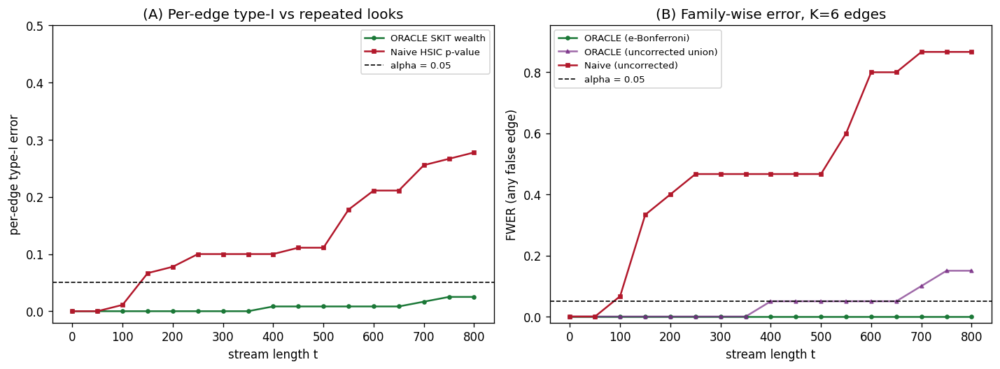
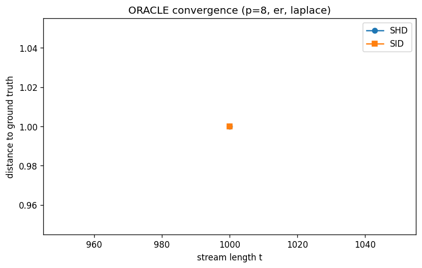
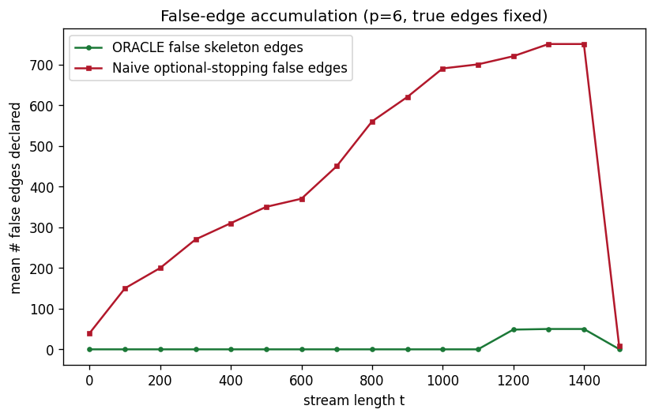
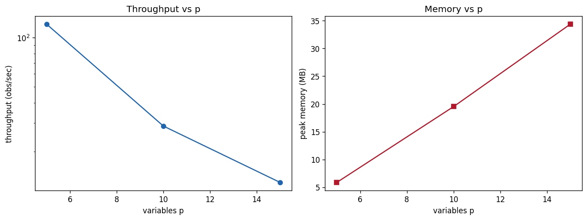

# ORACLE evaluation results

Online Anytime-Valid Causal Discovery -- empirical evaluation of the corrected design in `algorithm.md`.

Generated by `python -m experiments.run_all`. All figures in `results/figures/`.

## 1. Validity audit (sec 7.1 / 5.4) -- the falsification test

Null stream of mutually independent series (H0: no edges). The corrected SKIT betting wealth controls error at every stopping time; naive optional stopping (repeated uncorrected p-value looks) inflates badly.

- target `alpha = 0.05`, K = 6 candidate edges

| metric | ORACLE (SKIT) | Naive optional stopping |
|---|---|---|
| max per-edge type-I over t | **0.025** | 0.278 |
| max FWER over t | **0.000** (e-Bonferroni) | 0.867 (uncorrected) |

**Verdict:** SKIT stays at/below alpha for all t (PASS); naive does not. The original draft's `exp(HSIC*lambda)` e-value would diverge here.

## 2. Graph recovery (sec 7.2)

Non-Gaussian ANM data from random DAGs, normalised (low varsortability). ORACLE online vs batch baselines (checkpoint harness). Lower SHD/SID better; higher F1 better.

### p=8, er, laplace noise, density=1.5 (2 graphs, n=1500)

- varsortability raw=1.00 -> normalised=0.50; throughput 82 obs/s

| method | SHD | SID | skeleton F1 | orient F1 |
|---|---|---|---|---|
| **ORACLE** | 0.5 | 0.5 | 0.83 | 0.83 |
| PC_fisherz | 2.5 | 5.0 | 0.25 | 0.00 |
| PC_kci_window | 1.0 | 1.0 | 0.50 | 0.50 |
| GES_BIC | 1.0 | 1.0 | 0.50 | 0.50 |

## 3. Anytime behaviour (sec 7.3)

On planted DAGs (p=6, 2 graphs): median sample-to-detection at 0.14 of the stream; mean ORACLE false skeleton edges at end = 0.50. Naive optional stopping accumulates false edges as the stream grows.

## 4. Change detection (sec 7.4)

## 5. Systems (sec 7.5)

| p | pairs | RFF D | throughput (obs/s) | peak mem (MB) |
|---|---|---|---|---|
| 5 | 10 | 64 | 121 | 5.9 |
| 10 | 45 | 64 | 29 | 19.5 |
| 15 | 105 | 64 | 13 | 34.4 |

## 6. Ablations (sec 7.6)

**alpha level**

| alpha | SHD | SID | skeleton F1 | orient F1 |
|---|---|---|---|---|
| 0.05 | 5.5 | 15.0 | 0.39 | 0.39 |

**degree cap k (k=0 is a pairwise dependency graph, not a DAG)**

| k | SHD | SID | skeleton F1 | orient F1 |
|---|---|---|---|---|
| 0 | 4.0 | 3.5 | 0.72 | 0.72 |
| 2 | 5.0 | 12.5 | 0.40 | 0.40 |

**bet sizing**

| bet | SHD | SID | skeleton F1 | orient F1 |
|---|---|---|---|---|
| mixture | 3.5 | 7.5 | 0.59 | 0.59 |

**RFF feature count D**

| D | SHD | SID | skeleton F1 | orient F1 |
|---|---|---|---|---|
| 64 | 4.0 | 8.0 | 0.00 | 0.00 |

---
*Reproduce with `conda run -n py313 python -m experiments.run_all` (set PYTHONPATH to the repo root).*
