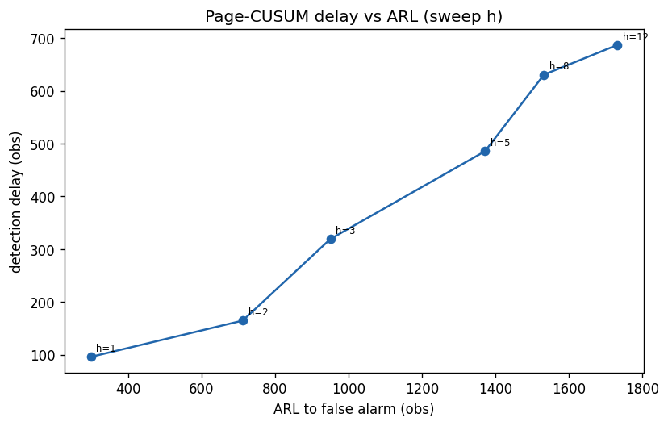

# ORACLE evaluation results

Online Anytime-Valid Causal Discovery -- empirical evaluation of the corrected design in `algorithm.md`.

Generated by `python -m experiments.run_all`. All figures in `results/figures/`.

## 1. Validity audit (sec 7.1 / 5.4) -- the falsification test

Null stream of mutually independent series (H0: no edges). The corrected SKIT betting wealth controls error at every stopping time; naive optional stopping (repeated uncorrected p-value looks) inflates badly.

- target `alpha = 0.05`, K = 6 candidate edges

| metric | ORACLE (SKIT) | Naive optional stopping |
|---|---|---|
| max per-edge type-I over t | **0.040** | 0.472 |
| max FWER over t | **0.010** (e-Bonferroni) | 0.983 (uncorrected) |

**Verdict:** SKIT stays at/below alpha for all t (PASS); naive does not. The original draft's `exp(HSIC*lambda)` e-value would diverge here.

## 2. Graph recovery (sec 7.2)

Non-Gaussian ANM data from random DAGs, normalised (low varsortability). ORACLE online vs batch baselines (checkpoint harness). Lower SHD/SID better; higher F1 better.

### p=10, er, laplace noise, density=1.5 (5 graphs, n=3000)

- varsortability raw=0.96 -> normalised=0.39; throughput 82 obs/s

| method | SHD | SID | skeleton F1 | orient F1 |
|---|---|---|---|---|
| **ORACLE** | 4.6 | 13.6 | 0.55 | 0.55 |
| PC_fisherz | 4.4 | 13.6 | 0.69 | 0.59 |
| PC_kci_window | 4.2 | 9.8 | 0.62 | 0.52 |
| GES_BIC | 5.8 | 14.6 | 0.61 | 0.54 |

### p=10, sf, t3 noise, density=2.0 (4 graphs, n=2500)

- varsortability raw=0.81 -> normalised=0.53; throughput 109 obs/s

| method | SHD | SID | skeleton F1 | orient F1 |
|---|---|---|---|---|
| **ORACLE** | 15.2 | 80.0 | 0.08 | 0.08 |
| PC_fisherz | 19.5 | 66.0 | 0.57 | 0.29 |
| PC_kci_window | 13.2 | 75.5 | 0.59 | 0.22 |
| GES_BIC | 23.2 | 55.5 | 0.51 | 0.33 |

### p=15, er, laplace noise, density=1.5 (2 graphs, n=2000)

- varsortability raw=0.93 -> normalised=0.56; throughput 52 obs/s

| method | SHD | SID | skeleton F1 | orient F1 |
|---|---|---|---|---|
| **ORACLE** | 10.5 | 29.0 | 0.47 | 0.47 |
| PC_fisherz | 12.5 | 56.0 | 0.67 | 0.47 |
| PC_kci_window | 10.0 | 62.0 | 0.76 | 0.40 |
| GES_BIC | 10.5 | 39.0 | 0.74 | 0.57 |

## 3. Anytime behaviour (sec 7.3)

On planted DAGs (p=6, 5 graphs): median sample-to-detection at 0.04 of the stream; mean ORACLE false skeleton edges at end = 0.40. Naive optional stopping accumulates false edges as the stream grows.

## 4. Change detection (sec 7.4)

Piecewise-stationary SCM (p=5, segment=1800, 2 change-points). Page-CUSUM on edge e-increments; sweep threshold h for the delay/ARL trade-off.

| h | mean delay (obs) | mean ARL to false alarm (obs) |
|---|---|---|
| 0.5 | n/a | 150 |
| 1 | 96 | 299 |
| 2 | 165 | 712 |
| 3 | 320 | 951 |
| 5 | 486 | 1372 |
| 8 | 631 | 1533 |
| 12 | 687 | 1732 |

- example planted change-points: [1800, 3600]
- ruptures (KernelCPD) detected: [1800, 3600, 5400]

## 5. Systems (sec 7.5)

| p | pairs | RFF D | throughput (obs/s) | peak mem (MB) |
|---|---|---|---|---|
| 5 | 10 | 64 | 236 | 5.8 |
| 10 | 45 | 64 | 59 | 19.5 |
| 20 | 190 | 64 | 15 | 69.8 |
| 30 | 435 | 32 | 7 | 140.6 |
| 50 | 1225 | 32 | 2 | 383.4 |

## 6. Ablations (sec 7.6)

**alpha level**

| alpha | SHD | SID | skeleton F1 | orient F1 |
|---|---|---|---|---|
| 0.01 | 3.8 | 10.0 | 0.44 | 0.44 |
| 0.05 | 3.0 | 7.8 | 0.66 | 0.66 |
| 0.1 | 3.2 | 8.2 | 0.56 | 0.56 |

**degree cap k (k=0 is a pairwise dependency graph, not a DAG)**

| k | SHD | SID | skeleton F1 | orient F1 |
|---|---|---|---|---|
| 0 | 1.5 | 0.5 | 0.89 | 0.89 |
| 1 | 2.2 | 6.5 | 0.76 | 0.76 |
| 2 | 2.8 | 7.8 | 0.67 | 0.67 |
| 3 | 3.5 | 9.2 | 0.44 | 0.44 |

**bet sizing**

| bet | SHD | SID | skeleton F1 | orient F1 |
|---|---|---|---|---|
| fixed | 4.5 | 11.5 | 0.36 | 0.36 |
| agrapa | 2.5 | 6.5 | 0.75 | 0.75 |
| mixture | 4.0 | 10.5 | 0.49 | 0.49 |

**RFF feature count D**

| D | SHD | SID | skeleton F1 | orient F1 |
|---|---|---|---|---|
| 32 | 1.8 | 3.8 | 0.84 | 0.84 |
| 64 | 2.0 | 4.0 | 0.80 | 0.80 |
| 128 | 2.8 | 5.5 | 0.70 | 0.70 |

---
*Reproduce with `conda run -n py313 python -m experiments.run_all` (set PYTHONPATH to the repo root).*
